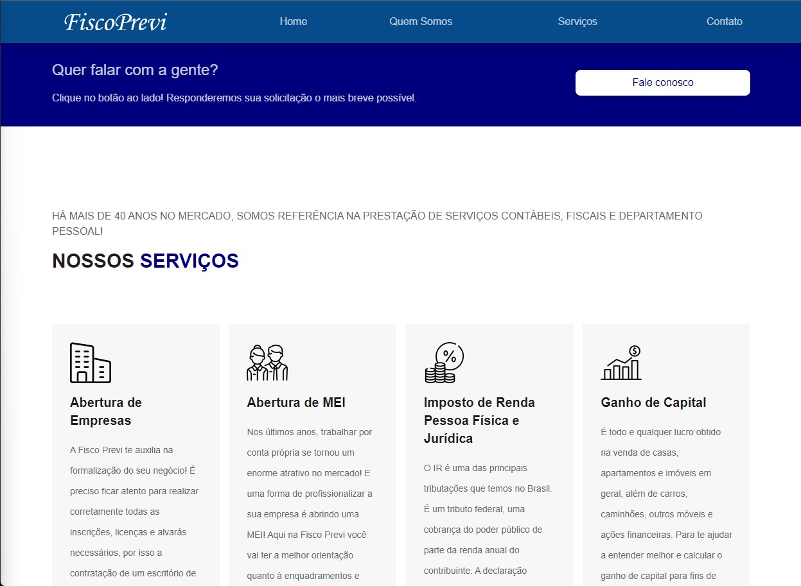
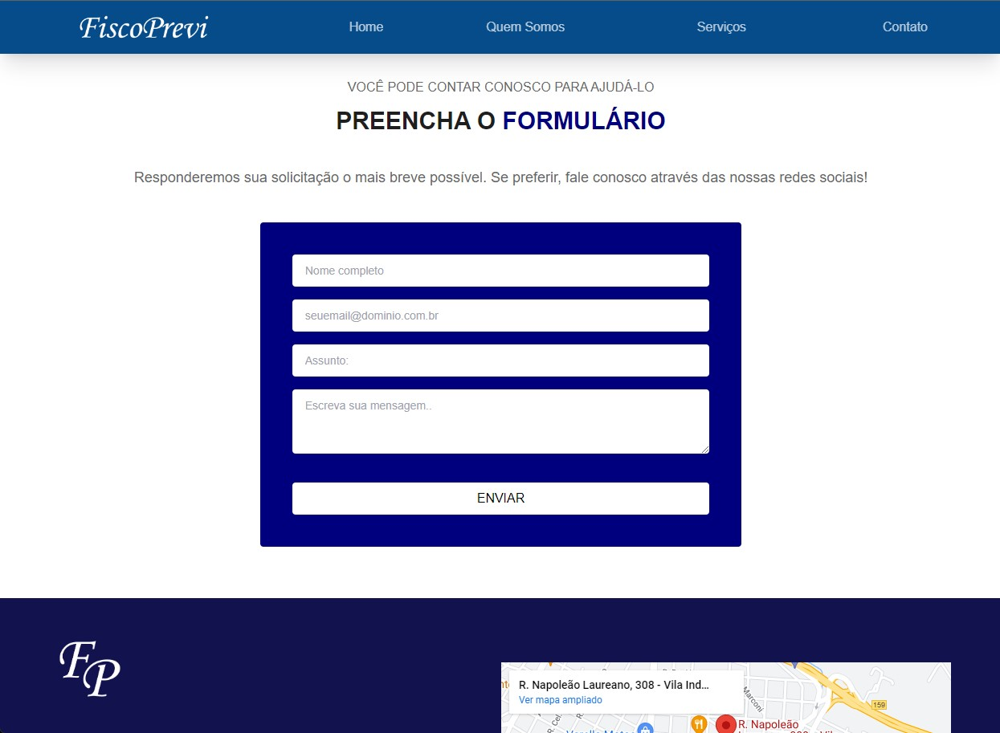

<h1 align="center">
  
</h1>

# FiscoPrevi

<h4 align="center"> 
  Site para empresa de contabilidade. <br />
	🚧  Status - Concluído 🚀 🚧
  <br />
  <a href="https://fiscoprevi.com.br/" target="_blank">🔗 Acesse o site aqui!
</a>
</h4>


---
## Índice
<br />

- <a href="#-sobre-o-projeto">Sobre</a>
- <a href="#-funcionalidades">Funcionalidades</a> 
- <a href="#-layout">Layout</a>
- <a href="#-como-executar-o-projeto">Como executar o projeto localmente</a>
- <a href="#-tecnologias">Tecnologias</a> 
- <a href="#-autor">Autor</a>
---

## 💻 Sobre o projeto

Site institucional desenvolvido a pedido do cliente com a intenção de posicionar-se nas pesquisas de busca e mostrar aos seus atuais e futuros clientes seu portfólio de serviços! ❤️

---

## ⚙ Funcionalidades

- [x] Nossos Serviços
- [x] Saiba Mais
- [x] Missão, Visão e Valores
- [x] Link's Úteis
- [x] Formulário de contato
---

## 🎨 Layout 

Como ficou o layout da aplicação:

---

## 📱 Mobile

<p align="center">

  

  

  

  

  

  

</p>

### 💻 Web

<p align="center">

  

  

  
  
  
</p>

---

## 🚀 Como executar o projeto

Este projeto possui apenas o Frontend

Antes de começar, você vai precisar ter instalado em sua máquina as seguintes ferramentas:

- [Git](https://git-scm.com)<br />
- [Node.js](https://nodejs.org/en/)

Além disto, é bom ter um editor de código para trabalhar com o código como o [VSCode](https://code.visualstudio.com/) .

#### 🎲 Rodando o Frontend 

```bash

#Clone o repositório: 
$ git clone git@github.com:thiago-mfernandes/FiscoPrevi.git

#Acesse a pasta do projeto pelo terminal/cmd
$ cd FiscoPrevi

#Acesse a subpasta
$ cd fisco-prev

#Instale as dependências do projeto
$ npm install

#Execute a aplicação em modo de desenvolvimento
$ npm start

# O servidor inciará na porta:3000 - acesse http://localhost:3000

```
---

## 🛠 Tecnologias

As seguintes ferramentas foram usadas na construção do projeto:

#### **Website**  

- **[React](https://reactjs.org/)**

- **[Typescript](https://www.typescriptlang.org/)**

- **[React-Hook-Form](https://react-hook-form.com/)**

- **[YUP](https://github.com/jquense/yup)**

- **[TailwindCSS](https://tailwindcss.com/)**


#### **Utilitários**

- **[React Icons](https://react-icons.github.io/react-icons/)**


- **[React Anchor Smooth Scroll](https://www.npmjs.com/package/react-anchor-link-smooth-scroll-v2)**


> Veja o arquivo [package.json](https://github.com/thiago-mfernandes/FiscoPrevi/blob/main/fisco-prev/package.json)

---

## 🦸 Autor


 
 <br />
 <sub>
  <b>Thiago Fernandes 🚀</b>
 </sub>
 

 
[](https://www.linkedin.com/in/thiago-mello-fernandes-frontend-react-js-javascript/)
---

## 📝 Licença


Feito com ❤️ por Thiago Fernandes 👋🏽 [Entre em contato!](https://whatsa.me/5519984009105)

---
